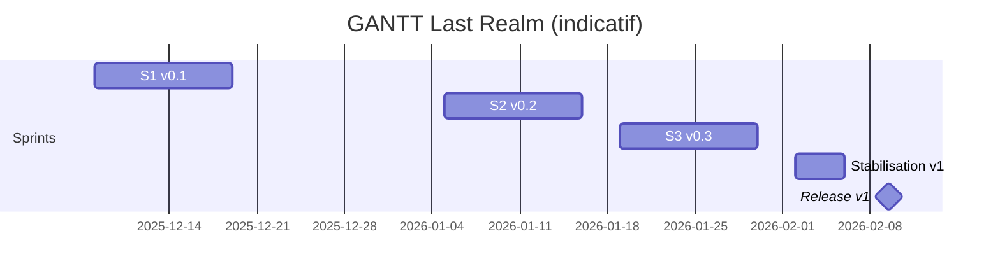

# Plan projet et livrables - Last Realm

## I. Contexte stratégique

### 1. Couples cibles <> problèmes (top 3)
- Joueurs casual web (15-30 min) : peu d'expériences roguelite rapides, onboarding souvent lourd, parties longues.
- Streamers/Twitch : besoin de runs courts et rejouables en solo pour animer des sessions rapides.
- Étudiants/hobbyistes du modding : rares jeux web solo faciles à étendre/configurer.

### 2. Persona prioritaire
- Persona : Léa, 22 ans, étudiante, joue 30 min par jour sur navigateur, veut progresser vite en solo.
- Jobs-to-be-done : lancer une partie en <2 min, comprendre immédiatement les règles, sentir sa progression, varier les builds.
- Pains : règles obscures, grind frustrant, perte de temps en onboarding, manque de rythme sur runs courts.
- Gains : montée en puissance visible, runs courts mais intenses, rejouabilité via power-ups.

### 3. Proposition de valeur (mission)
"Offrir un roguelite solo web jouable en quelques minutes, avec progression claire et builds variés pour des sessions courtes."

### 4. Solution cible et MVP
- MVP : auth simple, sélection de personnage, boucle de combat PVE solo courte (3 vagues + mini-boss), power-ups clés, tableau de bord de stats basiques, persistance profil.
- Hors MVP (later) : meta-progression élargie, événements/daily runs, leaderboard global, intégration Twitch (spectateur), éditeur de niveaux.

### 5. Vision produit (Product Vision Board)
- Objectif business : atteindre 500 DAU en 3 mois et rétention D7 > 15 %.
- KPI clés : temps de mise en partie < 90 s ; taux de complétion du premier run > 60 % ; NPS in-app > 30.
- Différenciation : 100 % web, prise en main < 2 min, builds variés via power-ups, sessions courtes, solo sans attente matchmaking.

## II. Cadrage projet

### 1. Méthodologie
- Scrum, itérations de 2 semaines, revues produit systématiques pour réduire le risque fun/engagement.

### 2. Story mapping (extrait)
- Entrer dans le jeu : créer compte / login / persister session.
- Se préparer : choisir personnage, voir stats de base, sélectionner power-ups.
- Jouer un run : lancer partie, combattre vagues, gagner XP/or, fin de run avec récap.
- Progresser : débloquer power-ups, voir progression, sauvegarder profil.
- Social (plus tard) : leaderboard, chat léger optionnel (sans coop/PVP).

### 3. Planification macro (roadmap)
| Sprint | Durée | Livrables majeurs |
| --- | --- | --- |
| S1 (v0.1) | 2 semaines | Auth + UI login/register, sélection personnage, power-ups basiques, run PVE 3 vagues, fin de run avec récap. |
| S2 (v0.2) | 2 semaines | Équilibrage combats, feedbacks visuels/sonores, analytics d'usage, onboarding guidé. |
| S3 (v0.3) | 2 semaines | Daily/weekly runs, équilibrage meta-progression, leaderboard simple, stabilité. |
| Stabilisation v1 | 1-2 semaines | Durcissement QA, perf, doc, préparation démo/release. |

### 3bis. GANTT détaillé (dates indicatives)
| Phase | Semaine | Dates (2025) | Livrables clés |
| --- | --- | --- | --- |
| S1 (v0.1) | W50-51 | 08/12 → 19/12 | Auth UI/BE, sélection personnage, power-ups basiques, run 3 vagues, écran récap. |
| S2 (v0.2) | W1-2 | 05/01 → 16/01 | Équilibrage combats, feedback visuel/sonore, analytics usage, onboarding guidé. |
| S3 (v0.3) | W3-4 | 19/01 → 30/01 | Daily/weekly runs, meta-prog équilibrée, leaderboard simple, stabilité. |
| Stabilisation v1 | W5 | 02/02 → 06/02 | QA renforcée, perf, documentation, préparation démo/release. |
| Release v1 | W6 | 09/02 | Déploiement v1 solo roguelite. |

#### Vue visuelle (Mermaid)

### 4. Release plan (v1 / v2)
- v1 (MVP) : solo PVE court, 3 classes jouables, 6 power-ups, stats profil, sauvegarde des runs.
- v2 : leaderboard enrichi, événements limités (daily/weekly), premiers outils de modding (config power-ups), intégration Twitch basique (spectateur).

## III. Préparation des développements

### 1. Backlog MVP (synthèse)
- Auth : register/login, token JWT, routes protégées, gestion erreurs UX.
- Personnage : 3 classes avec stats distinctes (HP/ATK/DEF/VIT), écran de sélection.
- Power-ups : 6 effets clés (heal, attaque+, vitesse+, critique, bouclier, AOE) alignés avec `frontend/config/POWERUPS_CONFIG.js`.
- Run PVE : 3 vagues croissantes + mini-boss, boucle gain XP/or, écran fin de run avec récap.
- Dashboard : profil, stats cumulées, progression par classe.
- Technique : persistance DB (users, players, runs, powerups), logs/erreurs gérées, loaders/états vides.
- UX : onboarding rapide (<3 clics), indications in-game claires.

### 2. Cadre du Sprint 1 (proposition)
- Sprint Goal : "Permettre à un nouveau joueur de créer un compte, choisir un personnage et terminer un run PVE court avec power-ups, pour mesurer la rétention jour 1."
- Livrables visés : auth front/back, store auth, sélection personnage, intégration power-ups config, boucle combat simple, écran fin de run, instrumentation analytics (start/end run), déploiement env dev.

### 3. Si cycle V/cascade requis (option)
- Cahier des charges fonctionnel MVP, spec technique (API, schéma DB), plan de tests d'intégration/auth/gameplay, GANTT 4-6 semaines.

## IV. Préparation de la présentation
- Slide "Cible & problèmes" : persona Léa, top 3 pains, méthode d'apprentissage utilisateur.
- Slide "Proposition de valeur" : mission, différenciation (web, rapidité, builds variés).
- Slide "Vision produit" : MVP, fonctionnalités clés, KPI (temps mise en partie, complétion run, rétention).
- Slide "Roadmap / GANTT" : S1/S2/S3 + jalons v1/v2.
- Slide "Product Goals" : v1 (solo PVE, 3 classes, 6 power-ups, stats), v2 (leaderboard, events, modding, intégration Twitch spectateur).
- Slide "Sprint 1" : périmètre, Sprint Goal, livrables UI/BE, mesure succès (taux complétion run, bugs bloquants).

## Ancrages vers le code
- Front : `frontend/src/components/Game.js`, `components/CharacterSelector.js`, `components/PowerupSelector.js`, `config/POWERUPS_CONFIG.js`.
- Back : `backend/routes/game.js`, `services/GameManager.js`, modèles `backend/models/Player.js` et `User.js`.
